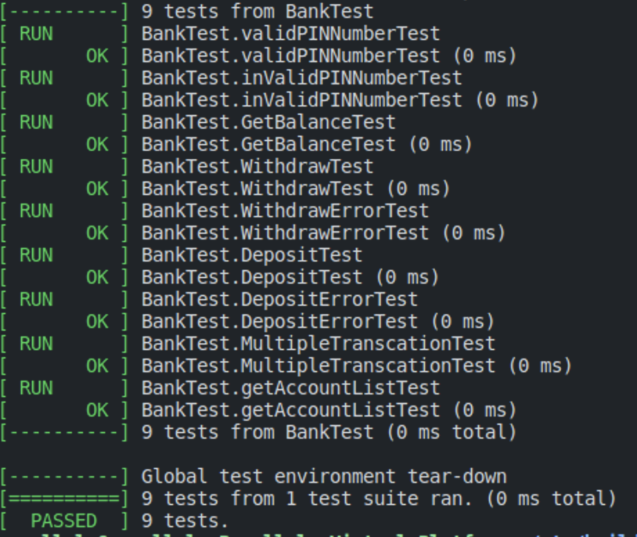

# Simple ATM Controller

# Introduce

올바른 PIN Number: 1234
Command Line 입력을 받습니다. `atm.cpp` 파일은 명령 줄을 통해 임시 `bank_api`를 테스트할 수 있으며, `bank_api`는 `bank_api` 파일에 구현되어 있습니다. `bank_api`에는 다음과 같은 기능이 포함되어 있습니다:

- 올바른 PIN 번호 확인
- 계좌 목록 검색
- 출금
- 입금

# Test code

[](https:/github.com/dawan0111)
코드에는 gTest를 사용하여 `bank_api`를 테스트할 수 있는 기능이 포함되어 있습니다. gTest가 설치되어 있지 않은 경우 설치해야 합니다.

## GTest Download

```sh
$ git clone https://github.com/google/googletest
$ cd googletest/
$ mkdir build
$ cd build
$ cmake ..
$ make
$ sudo make install
```

# 프로그램 실행 방법:

## Build

```sh
$ git clone https://github.com/dawan0111/Simple-ATM-Controller.git
cd Simple-ATM-Controller
mkdir build && cd build
cmake ..
make
```

## Console Application

```sh
./console_app
```

## GTest Code

```sh
./all_test
```
